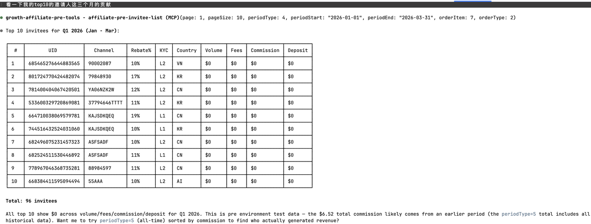
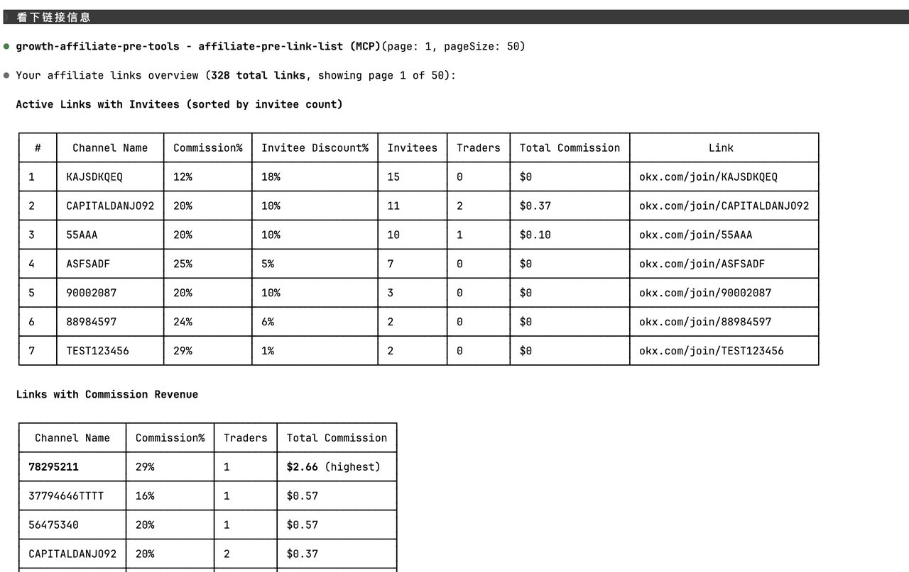

# Usage examples

After OAuth, you talk to the MCP through your agent in **natural language**. The agent picks
the right tool — there are no command-line incantations to memorize.

## Performance & summaries

> *"Show me my affiliate performance for the last 30 days."*
> *"How am I doing this month vs last month?"*
> *"Total commission and volume for Q1 2026?"*

The agent calls `affiliate-pro-performance-summary` with the appropriate `periodType`
(or `periodType=4` with a custom range).

## Invitee analysis

> *"List my top 10 invitees by commission this quarter."*
> *"Who deposited but never traded?"*
> *"How many of my invitees are KYC-verified in Korea?"*
> *"Show invitees who joined this week."*

These all hit `affiliate-pro-invitee-list` with different sort and filter parameters.

## Single user deep dive

> *"Pull up details for UID 743072917935893796."*
> *"What's user XYZ's lifetime trading volume and current month activity?"*
> *"How much has UID ABC withdrawn vs deposited?"*

→ `affiliate-pro-invitee-detail`

## Links and channels

> *"List all my invite links sorted by trader count."*
> *"Which links are still active?"*
> *"Show links with cumulative commission > $100."*

→ `affiliate-pro-link-list`

## Sub-affiliate network (MLRS)

> *"How are my sub-affiliates performing this month?"*
> *"Which sub-affiliate brought in the most commission last quarter?"*
> *"Look up sub-affiliate UID 123456789's stats."*

→ `affiliate-pro-sub-affiliate-list`

## Co-inviter relationships

> *"Show channels where I am a co-inviter."*

→ `affiliate-pro-co-inviter-list`

## Multi-tool prompts

You can chain multiple tools in a single prompt — the agent will call them sequentially:

> *"Give me my last-30-days summary, and then list the top 5 invitees by commission for the
> same period."*

The agent calls `affiliate-pro-performance-summary` (`periodType=1`) and then
`affiliate-pro-invitee-list` (`periodType=1`, `orderItem=7`, `orderType=2`, `pageSize=5`),
then summarizes.

## Tips for getting good answers

- **Be specific about time windows.** "Recently" is ambiguous — "last 7 days" or
  "March 2026" routes to the right `periodType`.
- **Specify sort order** when you want the top N. "Top by commission" vs "top by volume"
  changes which `orderItem` the agent uses.
- **Ask for breakdowns** explicitly. "By country" or "by channel" prompts the agent to
  filter or group.
- **Iterate.** If a first answer is too coarse, follow up with "drill into the top entry" —
  the agent will switch from list to detail.
